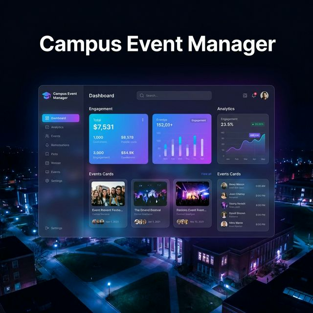
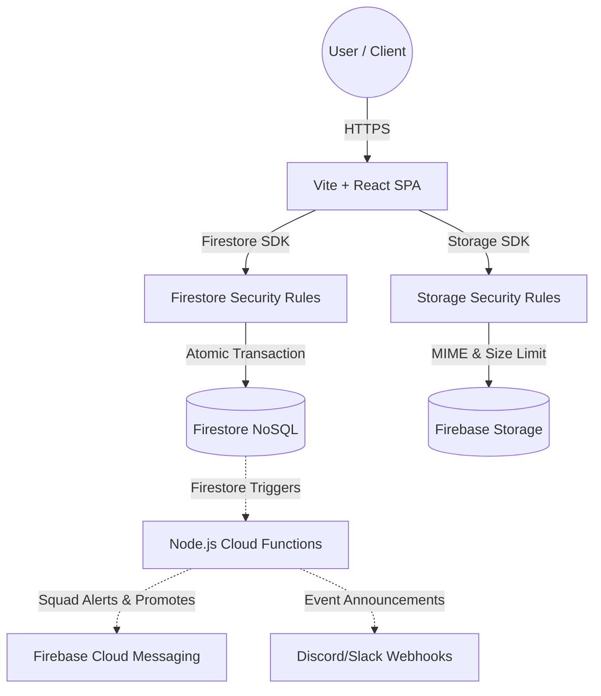

# 🎓 CampusConnect

<p align="center">
  
</p>

> *A premium, full-stack event management ecosystem engineered for high-performance university communities.*

<p align="center">
  <a href="https://react.dev/"></a>
  <a href="https://vite.dev/"></a>
  <a href="https://firebase.google.com/"></a>
  <a href="https://tailwindcss.com/"></a>
  <a href="https://www.typescriptlang.org/"></a>
  <a href="LICENSE"></a>
</p>

---

## 📖 Table of Contents

- [Project Overview](#-project-overview)
- [Key Features](#-key-features)
- [Technical Architecture](#%EF%B8%8F-technical-architecture)
- [Security & Reliability](#%EF%B8%8F-security--reliability)
- [Getting Started](#-getting-started)
- [Docker Deployment](#-docker-deployment)
- [Environment Variables](#%EF%B8%8F-environment-variables)
- [Default Accounts](#-default-accounts)
- [API Documentation](#-api-documentation)
- [Contributing](#-contributing)
- [License](#-license)

---

## 🎯 Project Overview

**CampusConnect** is a sophisticated university middleware designed with a **mobile-first** philosophy. It bridges the communication gap between student organizations and university administrations, leveraging modern UI/UX design principles—like glassmorphism and micro-animations—coupled with enterprise-grade backend stability to provide a cohesive, scalable, and secure campus experience.

### 📱 Preview

<p align="center">
  
</p>

---

## ✨ Key Features

### 🧑‍🎓 For Students

- **Mobile-First & Glassmorphism UI** — Highly responsive, premium, translucent interface.
- **Micro-Animations** — Fluid transitions and interactive elements for an engaging experience.
- **Dynamic QR Integration** — Automatic registration QR codes for instant, contactless event enrollment.
- **Calendar Sync** — Export events directly to Google / Outlook with a single click.
- **Smart Filtering** — Categorize events by *Technical*, *Cultural*, *Sports*, and *Workshop*.

### 👨‍💼 For Administrators

- **Interactive Analytics** — Dashboard powered by Chart.js with real-time engagement tracking.
- **Lifecycle Management** — Robust administrative controls for event creation, modification, and automated lifecycle handling.
- **Data Export** — One-click CSV export for university-wide event statistics and audits.
- **System Health Monitoring** — Real-time server resource tracking from the admin panel.

---

## 🏗️ Technical Architecture

CampusConnect follows a clean, highly modular serverless architecture with strictly defined security boundaries for client logic, database rules, and file security.



### 🛠️ Technology Stack

| Layer | Technology |
| :--- | :--- |
| **Frontend** | React 19, Vite 8, TypeScript 6, Tailwind CSS v4, Framer Motion |
| **Backend Triggers** | Node.js 20, TypeScript, Firebase Cloud Functions v2 |
| **Database** | Google Cloud Firestore (NoSQL, Atomic Multi-Document Transactions) |
| **Authentication** | Firebase Auth (JWT Tokens, Custom Admin Claims) |
| **Media Storage** | Google Cloud Storage (Mime-restricted, Max Capacity Enforced) |
| **Hosting** | Firebase Global CDN Hosting |
| **Testing** | Vitest 4, Happy DOM, React Testing Library |

---

## 🛡️ Security & Reliability

### Security Hardening (Zero-Trust)

- **Role Escalation Protection** — Hardened Firestore database rules block users from updating their `role` attributes, restricting `ADMIN` claims exclusively to validated operations.
- **SQL / Injection Immunity** — Standardized Firestore Document references completely negate query injection and path traversal vulnerabilities.
- **Secure File Storage** — Storage policies enforce strict MIME validation and maximum size constraints (<5MB for event covers, <2MB for user avatars).
- **Concurrency & Race Conditions** — Multi-document atomic operations and priority waitlist queue management ensure race-condition immunity.

### Architecture Resilience

- **FCM Push Notifications** — Real-time Firebase Cloud Messaging keeps students notified of waitlist promotions and squad assemblies.
- **Offline First PWA** — Dynamic PWA service workers cache static assets and clone dynamic content streams to prevent cache corruption.

---

## 🚀 Getting Started

### Prerequisites

- **Node.js 20+**
- **npm** (v10+)
- **Firebase CLI** (`npm install -g firebase-tools`)

### Quick Start

1. **Clone the Repository**

   ```bash
   git clone https://github.com/tejaswin-amara/campus-connect.git
   cd campus-connect
   ```

2. **Install Frontend & Functions Dependencies**

   ```bash
   cd frontend && npm install
   cd ../functions && npm install
   cd ..
   ```

3. **Run the Application Locally**

   Run the all-in-one local development script to spin up both the Vite React hot-reload server and the offline Firebase Emulators:
   ```bash
   # Windows PowerShell
   .\run_app.ps1
   ```

4. **Open the App**

   - **Frontend Hub:** [`http://localhost:5173/`](http://localhost:5173/)
   - **Database & Auth Simulator UI:** [`http://localhost:4000/`](http://localhost:4000/)

### Stopping the Application

To shut down all background emulation and client ports cleanly:
```powershell
.\stop_app.ps1
```

---

## 🐳 Docker Deployment

### Local Container Build

You can serve the static React frontend in a hardened container using the provided multi-stage build:

```bash
# Build the Vite client and package it into Nginx Alpine
docker compose up -d
```

The app will be accessible locally at [`http://localhost:9090`](http://localhost:9090).

### Production Firebase Deployment

To deploy hosting assets, security rules, indexes, and Cloud Functions triggers directly to live Google Cloud servers:

```powershell
.\deploy.ps1
```

---

## 🔑 Default Emulator Accounts

On first emulator start, you can use these test accounts populated in local Firestore/Auth simulators:

| Role | Username / Email | Password |
| :--- | :--- | :--- |
| **Administrator** | `admin@campusconnect.com` | `admin123` |
| **Student** | `student@campusconnect.com` | `student123` |

---

## 📚 API Documentation

Since the architecture is fully serverless, direct database calls and functions are documented inline:

- **Swagger UI:** [`http://localhost:9090/swagger-ui.html`](http://localhost:9090/swagger-ui.html)
- **OpenAPI JSON:** [`http://localhost:9090/v3/api-docs`](http://localhost:9090/v3/api-docs)

---

## 🤝 Contributing

Contributions are welcome! Please read the [Contributing Guide](CONTRIBUTING.md) and the [Technical Guide](TECHNICAL_GUIDE.md) before submitting a pull request.

---

## 📄 License

This project is licensed under the **MIT License** — see the [LICENSE](LICENSE) file for details.

---

<p align="center">
  <br>
  Created and maintained by <strong>Tejaswin Amara</strong> <br>
  <i>Integrated as per university guidelines.</i>
</p>
